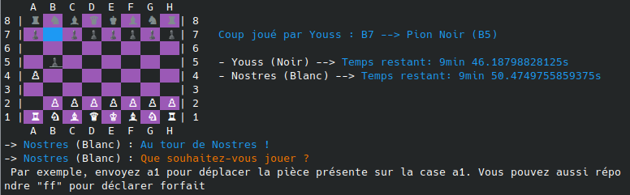

# Bienvenue sur le projet JavaChess !
Il s'agit d'un projet de jeu d'échecs en java. Initialement dans le cadre d'un projet évalué en BUT Informatique, première année.
En collaboration avec @YoussTV



## I) Lancer le jeu d’échecs
Dans un premier temps, il faut vous assurer que l’application Java est bien installée sur votre système.
Pour lancer le jeu d'échecs dans le terminal, ouvrez le terminal de votre système (Invite de commande pour windows) dans le dossier où se situe le fichier JavaChess.jar.
Ensuite tapez :
```bash
java -jar JavaChess.jar
```
*"java" peut ne pas être reconnu sur windows même si l'application Java est installée, si la variable d'environnement est manquante*

## II) Développement
Réalisé avec [Vscode](https://code.visualstudio.com/), mais des IDE comme [Eclipse](https://www.eclipse.org/downloads/) ou [IntelliJ](https://www.jetbrains.com/idea/) sont plus adaptés au langage java

### Affichage
Format:
> À la lecture du sujet, nous avons envisagé deux possibilités :
> - Affichage graphique : ouvrir une fenêtre pour représenter graphiquement l'échiquier etc...
> - Affichage en texte dans le terminal: Afficher toutes les informations et décrire toutes les actions sous la forme de texte.
> 
> Le faire graphiquement prendrait beaucoup trop de temps pour disposer les éléments efficacement. Surtout qu'il faut apprendre à le faire. Nous avons donc choisi d'afficher l'échiquier dans le terminal.
> 
> Nous avons donc décidé de disposer les différentes pièces de sorte à ce qu'elles soient représentées dans des cases qui sont d'ailleurs affichées en damier grâce à la possibilité de changer la couleur de fond dans le terminal.
> Les pièces sont alors représentées par un seul caractère, la première lettre du nom de la pièce. Une légende est affichée au début de la partie.
> 
> Nous voulions dans un premier temps utiliser les [caractères unicode de chaque pièce d'échecs](https://fr.wikipedia.org/wiki/Symboles_d%27%C3%A9checs_en_Unicode). Cela fonctionne parfaitement sur linux mais après quelques tests, nous nous sommes rendu compte que ces caractères ne s'affichent pas dans le terminal Windows et dans powershell. Ne permettant donc pas le bon fonctionnement du programme sur Windows. Cette fonctionnalité est alors restée expérimentale.

### Expérience utilisateur

Bien que ce soit demandé ainsi, nous sommes conscient qu’un jeu d'échecs dans le terminal n’est pas le meilleur choix en termes d'expérience utilisateur. C’est pour cela que nous avons fait de notre maximum pour assurer une expérience optimale dans le terminal.
Notamment avec:
- Un échiquier visible en tableau, avec des cases en damier violet et noir car ce sont les seules couleurs dans le terminal qui ne changent pas la couleur des pièces.
- Des messages d’aide comme une légende ou des messages explicites pour guider l’utilisateur, avec des exemples.
- La possibilité de déclarer forfait pour mettre fin à la partie si le plaisir venait à manquer.
- La possibilité de préciser la case d’arrivée et la case de départ d’un coup pour aller plus vite ou de le faire en deux temps pour être mieux guidé.
- Affichage en texte du déplacement effectué en plus d’un indicateur visuel sur l’affichage de l’échiquier (la pièce déplacée est soulignée et son ancienne case est en bleu);
- La possibilité de choisir de jouer avec une horloge ou pas.
- La possibilité de relancer la partie avec une question demandant si une revanche est souhaitée.

### Échiquier

Nous avons choisi de représenter l'échiquier en matrice afin de pouvoir appliquer les algorithmes et les formules de calculs relatifs à des coordonnées, des points ou des déplacements (vecteurs).
Cela permet aussi d'accéder aux informations d'une case ou d'une pièce en fonction de son emplacement, sans devoir lire une liste.

### Optimisation

Le code a été fait de sorte à minimiser le nombre d'opérations.
Les données stockées par le programme prennent une place minime en mémoire vive. C'est pour cela que nous nous permettons d'utiliser davantage d'attributs que nécessaire au profit d'une réduction du nombre d'opérations durant une partie.

À ce sujet, la détection de fin de partie nous a donné du fil à retordre. La solution choisie a donc été la plus simple. Une autre solution pour réduire le nombre d’opérations aurait été de détecter les situations de mise en échec au fil de la partie. En évitant donc de re vérifier des situations inchangées sur plusieurs tours. Mais cette solution est bien trop complexe pour les exigences du projet et les dates limites imposées.

### Organisation du code

En plus de ce qui a été dit dans les parties précédentes, nous avons décidé de nommer les variables et les méthodes en français uniquement pour être cohérent avec le sujet et les habitudes de la formation. Même si cela amène à des incohérences comme le mélange d’anglais et de français pour les getters et les setters. Les noms en français sont aussi moins optimaux qu’en anglais.
De plus, le code doit être clair, c’est ainsi que nous avons décidé de rajouter l’annotation @Override aux fonctions redéfinies comme deplacement(Case nouvelleCase) pour chaque type de pièce et que nous avons défini les attributs qui ne s’initialisent qu’une fois en constante (final). 
Enfin, puisque cela a été demandé, des commentaires décrivant la fonction de certains blocs de codes et expliquant l’organisation du code sur certains points ont été ajoutés.

### Scanners

Nous avons remarqué que fermer un scanner ouvert sur System.in (la console) ne nous permet pas d’en ouvrir un autre d’une nouvelle instance sur la console. Sous peine de provoquer une exception.
Par conséquent nous avons décidé de ne pas fermer les scanners. De toute façon tout le jeu utilise les scanner, cela n’a donc aucune conséquence négative.


### Version de java

Le développement a été fait avec un jdk version 21. Même si cela n’a pas été précisé, nous avons envisagé la possibilité que le correcteur possède une version antérieure.
De plus, les enseignements de la formation se limitent à la version 8. Mais pour télécharger le jdk 8 sur le site oracle.com, il faut créer un compte. Nous avons donc pu l’installer à l’aide d’une [source alternative](https://github.com/adoptium/temurin8-binaries/releases/).
C’est alors que nous avons revu le code pour qu’il soit compatible avec java 8.
Car, en effet nous avions utilisé des syntaxes introduites dans des versions plus récentes, apprises sur le tas, comme:
- Les expressions de switch sous la forme `case L -> Labels` introduites en java 14
- Et les “Type paterns” avec les conditions en instanceof (ex: `if(piece instanceof Roi roi) {...}`) introduits en java 16


### Autres idées

Pour améliorer le projet, nous pouvons dans un premier temps développer une **interface graphique**. Ça prend du temps mais c’est rentable pour une meilleure ergonomie.
Dans un deuxième temps, on pourrait **afficher les pièces mangées**.
Pour finir par potentiellement **afficher la règle relative à la pièce sélectionnée lorsqu’un déplacement est invalide**.
Ces idées n’ont pas été réalisées soit pour des raisons de temps soit pour éviter de compliquer davantage la structure du code
> Si certains tombent sur ce projet et souhaitent essayer d'améliorer le code et/ou d'ajouter des fonctionnalités comme celles proposées, n'hésitez pas. Ça peut faire un bon exercice de programmation ! *Je précise que le code actuel n'est pas à prendre comme un exemple sans défaut, il y en a plusieurs et j'en suis concient*.
